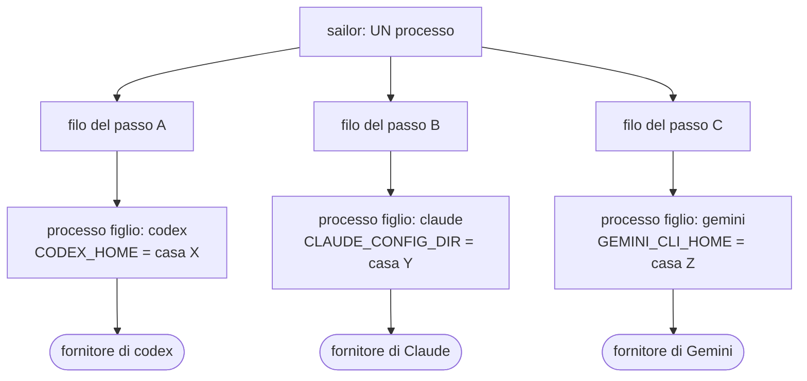
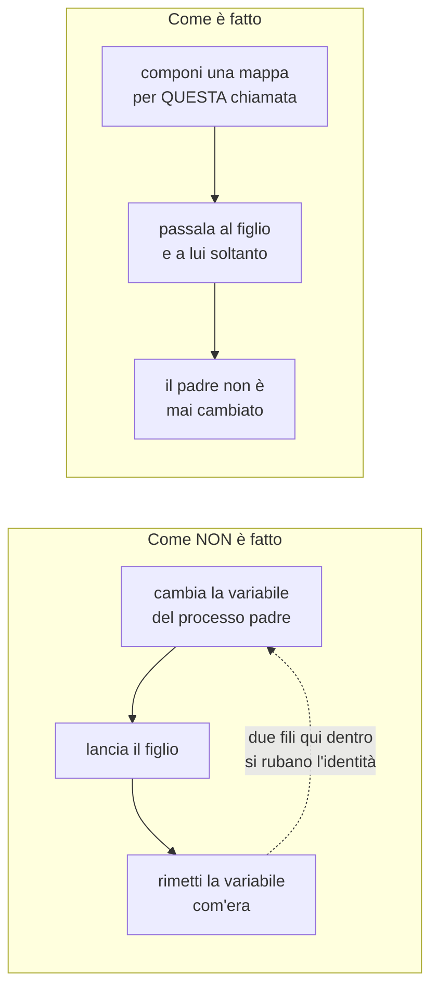
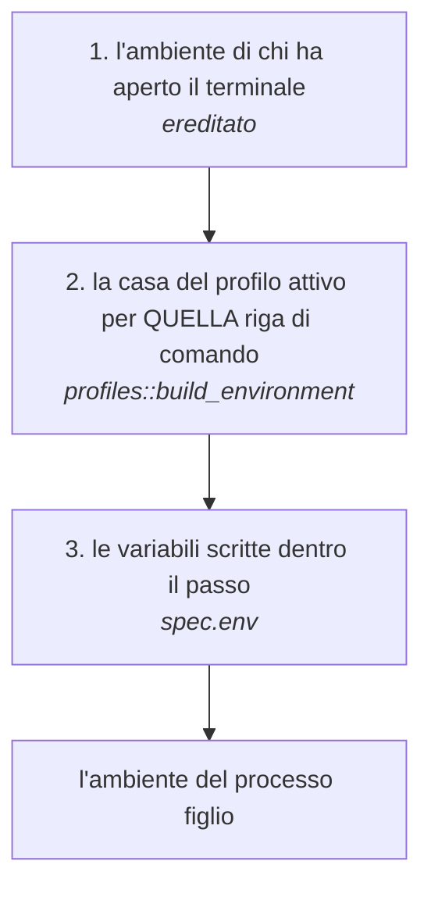
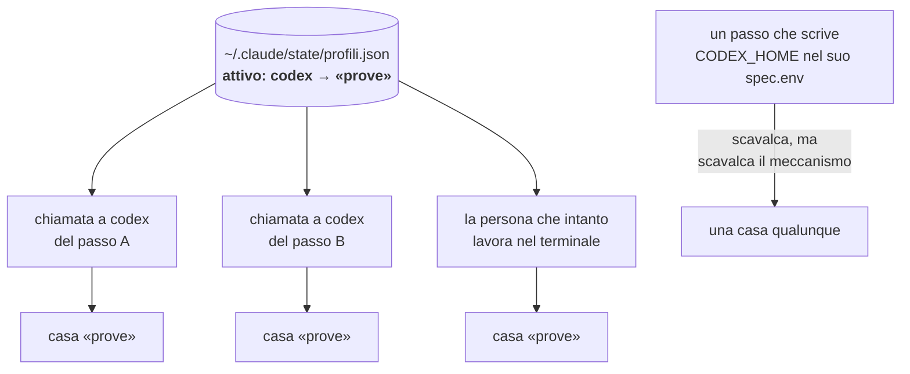
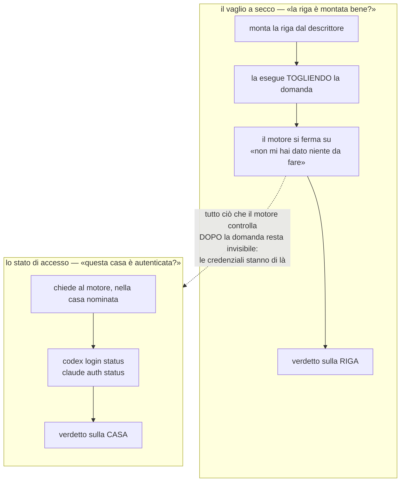
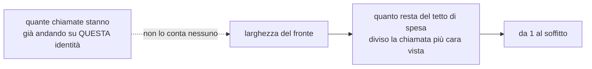

# Come arrivano le credenziali ai motori

Scritto il 01/09/2026 leggendo il codice, non a memoria. Ogni cosa disegnata qui
è stata verificata nel sorgente o eseguendo; dove una cosa **non** c'è, il
disegno lo dice invece di sottintenderlo.

La domanda da cui nasce: *come si gestisce il parallelismo di più righe di
comando con credenziali diverse?*

---

## 1. Chi lancia chi

Un flusso non parla con nessun fornitore. Fa partire **processi figli**, uno per
chiamata, e ognuno parla per conto suo.

**I passi in parallelo sono fili dentro un solo processo** (`std::thread::scope`
in `crates/flow/src/executor.rs`). Questo è il motivo per cui il punto seguente
non è un dettaglio ma la cosa che tiene in piedi tutto il resto.

---

## 2. La regola che rende sicuro il parallelismo

Ci sono due modi di dare a un programma una casa di credenziali diversa. Sailor
usa il secondo, e la differenza è tutta qui.

Verificato: nel codice di produzione dell'intero workspace **non esiste nessuna
chiamata che cambi l'ambiente del processo** — le uniche stanno dentro le prove.
L'ambiente arriva al figlio con `cmd.env(chiave, valore)`, cioè sovrapposto a
quello ereditato, per quel figlio solo.

**Conseguenza: righe di comando diverse, in parallelo, con credenziali diverse,
funzionano.** Non per attenzione di chi scrive i passi: per costruzione.

---

## 3. Come si compone l'ambiente di una chiamata

Tre strati. Chi sta più in alto vince.

Il verso è una decisione, non un caso: chi scrive una variabile **dentro un
passo** sta dicendo qualcosa di preciso su *quella* chiamata, e non deve poter
essere scavalcato da uno stato che vive altrove e che il passo non nomina.

Il legame fra una riga di comando e la sua variabile passa dall'**eseguibile**,
non dal nome che gli dà il catalogo: a leggere `CLAUDE_CONFIG_DIR` è il binario
`claude`, comunque lo chiami chi lo nomina. E il riconoscimento è per nome
esatto, mai per prefisso: un `claude-wrapper` non riceve la casa di `claude`.

---

## 4. Cosa è condiviso e cosa no — il punto della domanda

**L'identità si sceglie per riga di comando, non per corsa e non per passo.**
`attivo: codex → prove` è **un solo interruttore** per tutto quanto:

- due passi paralleli che vogliono entrambi codex prendono la **stessa**
  identità;
- lo stato viene **riletto a ogni chiamata** — di proposito, così un cambio ha
  effetto subito — quindi se qualcuno cambia mentre una corsa gira, due chiamate
  della *stessa corsa* finiscono su due identità. Adesso resta **scritto** quale
  ha usato ognuna (il deposito registra il profilo risolto), quindi si vede dopo:
  non è impedito;
- una persona che lavora nel terminale condivide quell'interruttore col flusso.

L'unico modo, oggi, di avere due identità diverse in parallelo sulla stessa riga
di comando è scrivere la variabile a mano dentro il passo — cioè **scavalcare i
profili invece di usarli**.

---

## 5. Le due domande che si fanno prima di lanciare

Sono due, e vedono cose diverse. Confonderle è già costato un verde falso.

Il vaglio a secco toglie la domanda **apposta**: è così che prova una riga vera
senza spendere niente. Ma per questo non può vedere niente di ciò che viene
dopo. Misurato: con una casa vuota e con quella vera, `codex exec < /dev/null`
dà la **stessa** risposta — e per un'ora `flow check` ha detto «riga sana» su una
casa senza credenziali.

La seconda domanda è nata il 01/09 per questo. Le parole del sì e del no
**le dichiara il descrittore del motore**, non il codice, come già per le altre
risposte che un motore può dare. Chi non le dichiara ottiene «nessuno ha
guardato», mai «è autenticato»: `gemini` e `agy` sono in questo stato, con scritto
dove si è guardato e cosa non si è trovato.

Una trappola che il disegno non mostra e che il codice sì: **«Not logged in»
contiene «logged in»**. Il no si legge prima del sì, e il sì si dichiara con più
parole di una.

---

## 6. Quanti ne partono insieme

La larghezza si stringe quando i soldi calano, fino a uno. **Non si stringe
quando è l'identità a essere sotto sforzo**: cinque passi affiancati sullo stesso
profilo sono cinque chiamate contro lo stesso limite orario, e quel conto non
esiste.

---

## 7. Cosa c'è e cosa manca

| | stato |
|---|---|
| righe di comando diverse in parallelo, case diverse | **c'è**, per costruzione |
| il padre non cambia mai identità | **c'è**, verificato su tutto il workspace |
| il passo scavalca il profilo | **c'è** |
| sapere, dopo, quale profilo ha usato una chiamata | **c'è** dal 01/09 |
| sapere, **prima**, se una casa è autenticata | **c'è** dal 01/09, per i motori che lo dichiarano |
| **«questa corsa usa il profilo X»** | **manca** |
| **«questo passo usa il profilo X»** — nominando un profilo, non una variabile | **manca** |
| contare le chiamate in volo per identità | **manca** |
| leggere la quota **del profilo** invece che della persona | **manca** — `sailor remaining` legge la casa della persona |

Le prime due assenze sono la stessa cosa, ed è il **terzo livello**: la ricerca
del 29/08/2026 (la nota `profili-e-consumo`) aveva già misurato che AWS, Google
Cloud e Kubernetes hanno tutti e tre la stessa forma — un file permanente, una
variabile d'ambiente, e **uno scavalco per singolo comando** — e che Sailor ha i
primi due. Il terzo ha un effetto secondario che vale da solo: **una corsa torna
a essere una misura**, invece della somma di qualunque cosa fosse attiva istante
per istante.
