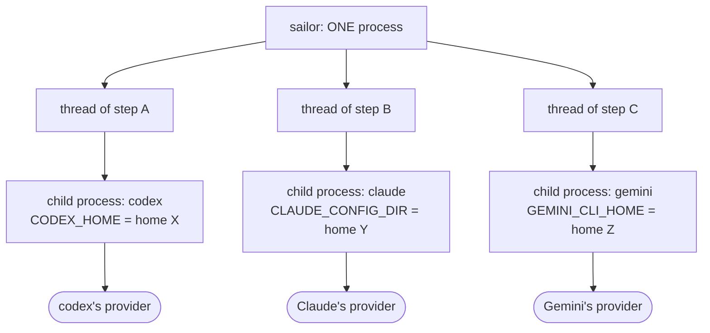
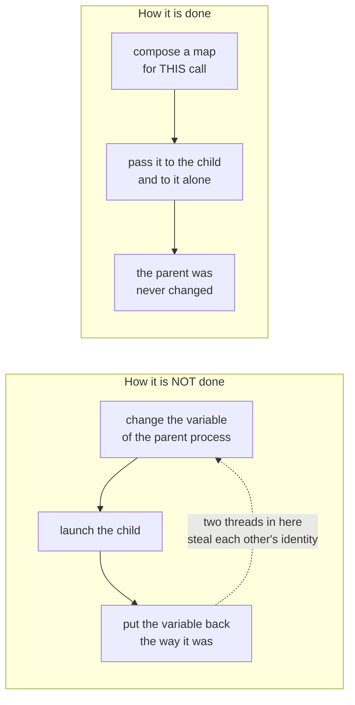
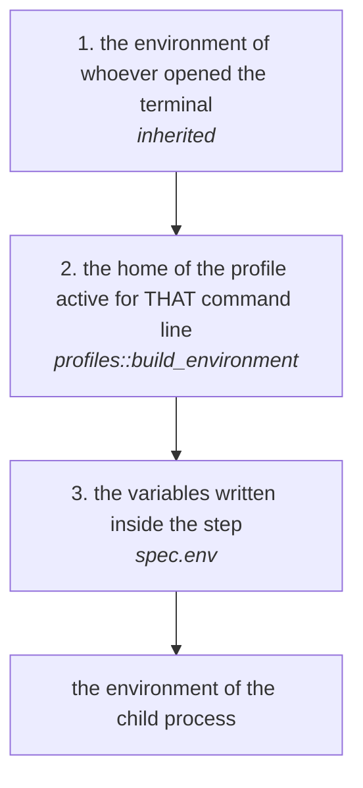
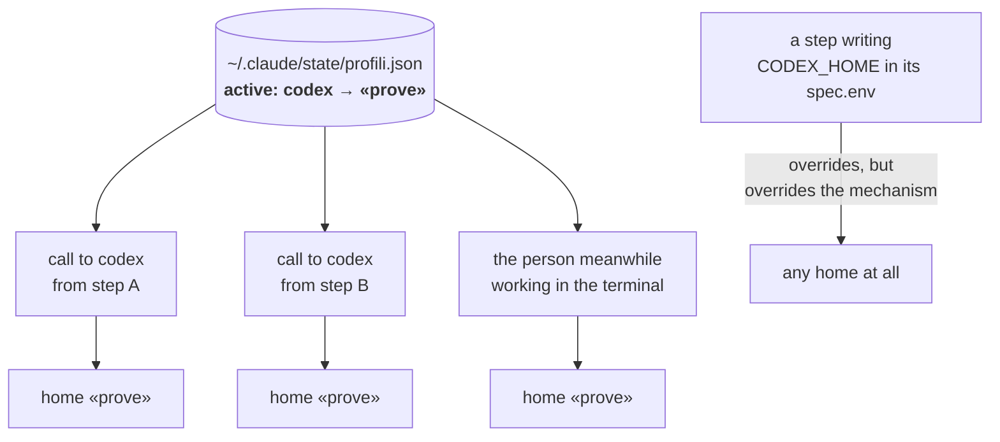
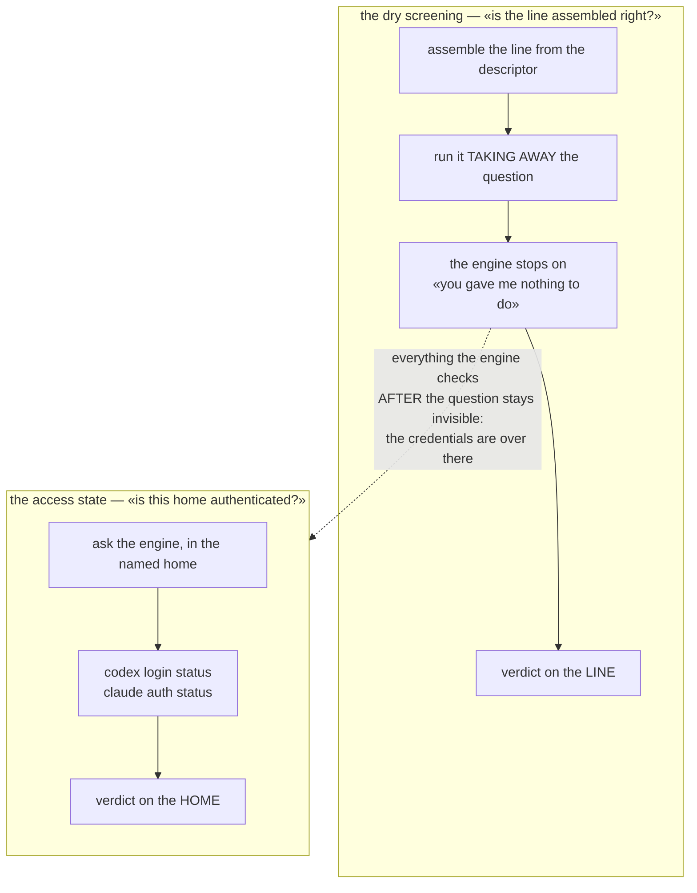
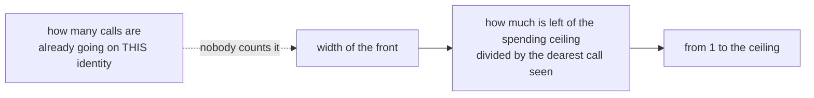

# How credentials reach the engines

Written on 01/09/2026 by reading the code, not from memory. Everything drawn
here was checked in the source or by running it; where a thing is **not** there,
the drawing says so instead of leaving it implied.

The question it is born from: *how do you handle the parallelism of several
command lines with different credentials?*

---

## 1. Who launches whom

A flow speaks to no provider. It starts **child processes**, one per call, and
each of them speaks on its own behalf.

**Parallel steps are threads inside one single process** (`std::thread::scope`
in `crates/flow/src/executor.rs`). This is why the following point is not a
detail but the thing holding all the rest up.

---

## 2. The rule that makes parallelism safe

There are two ways of giving a program a different home of credentials. Sailor
uses the second, and the difference is all here.

Checked: in the production code of the whole workspace **there is no call that
changes the process environment** — the only ones are inside the tests. The
environment reaches the child with `cmd.env(key, value)`, that is, laid over the
inherited one, for that child alone.

**Consequence: different command lines, in parallel, with different credentials,
work.** Not through the care of whoever writes the steps: by construction.

---

## 3. How the environment of a call is composed

Three layers. Whoever sits higher wins.

The direction is a decision, not an accident: whoever writes a variable **inside
a step** is saying something precise about *that* call, and must not be
overridable by a state that lives elsewhere and that the step does not name.

The link between a command line and its variable goes through the
**executable**, not through the name the catalogue gives it: what reads
`CLAUDE_CONFIG_DIR` is the `claude` binary, whatever whoever names it calls it.
And the recognition is by exact name, never by prefix: a `claude-wrapper` does
not get `claude`'s home.

---

## 4. What is shared and what is not — the point of the question

**The identity is chosen per command line, not per run and not per step.**
`active: codex → prove` is **one single switch** for the whole lot:

- two parallel steps that both want codex take the **same** identity;
- the state is **read again at every call** — on purpose, so that a change takes
  effect at once — so if somebody changes it while a run is going, two calls of
  the *same run* end up on two identities. It now stays **written down** which
  one each of them used (the store records the resolved profile), so it can be
  seen afterwards: it is not prevented;
- a person working in the terminal shares that switch with the flow.

The only way, today, of having two different identities in parallel on the same
command line is to write the variable by hand inside the step — that is, to
**override the profiles instead of using them**.

---

## 5. The two questions asked before launching

There are two, and they see different things. Confusing them has already cost a
false green.

The dry screening takes the question away **on purpose**: that is how it tries a
real line without spending anything. But for that same reason it can see nothing
of what comes after. Measured: with an empty home and with the real one,
`codex exec < /dev/null` gives the **same** answer — and for an hour
`flow check` said «line healthy» about a home with no credentials.

The second question was born on 01/09 for this. The words of the yes and of the
no **are declared by the engine's descriptor**, not by the code, as already
happens for the other answers an engine can give. Whoever does not declare them
gets «nobody looked», never «it is authenticated»: `gemini` and `agy` are in
this state, with a note of where the looking happened and what was not found.

A trap the drawing does not show and the code does: **«Not logged in» contains
«logged in»**. The no is read before the yes, and the yes is declared with more
than one word.

---

## 6. How many start together

The width narrows when the money goes down, all the way to one. **It does not
narrow when it is the identity that is under strain**: five steps side by side
on the same profile are five calls against the same hourly limit, and that count
does not exist.

---

## 7. What is there and what is missing

| | state |
|---|---|
| different command lines in parallel, different homes | **there**, by construction |
| the parent never changes identity | **there**, checked across the whole workspace |
| the step overrides the profile | **there** |
| knowing, afterwards, which profile a call used | **there** since 01/09 |
| knowing, **beforehand**, whether a home is authenticated | **there** since 01/09, for the engines that declare it |
| **«this run uses profile X»** | **missing** |
| **«this step uses profile X»** — naming a profile, not a variable | **missing** |
| counting the calls in flight per identity | **missing** |
| reading the quota **of the profile** instead of the person's | **missing** — `sailor remaining` reads the person's home |

The first two absences are the same thing, and it is the **third level**: the
research of 29/08/2026 (the note `profili-e-consumo`) had already measured that
AWS, Google Cloud and Kubernetes all three have the same shape — a permanent
file, an environment variable, and **a per-command override** — and that Sailor
has the first two. The third has a side effect that is worth it on its own: **a
run goes back to being a measurement**, instead of the sum of whatever happened
to be active from instant to instant.
