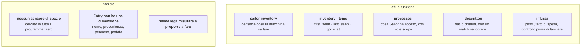
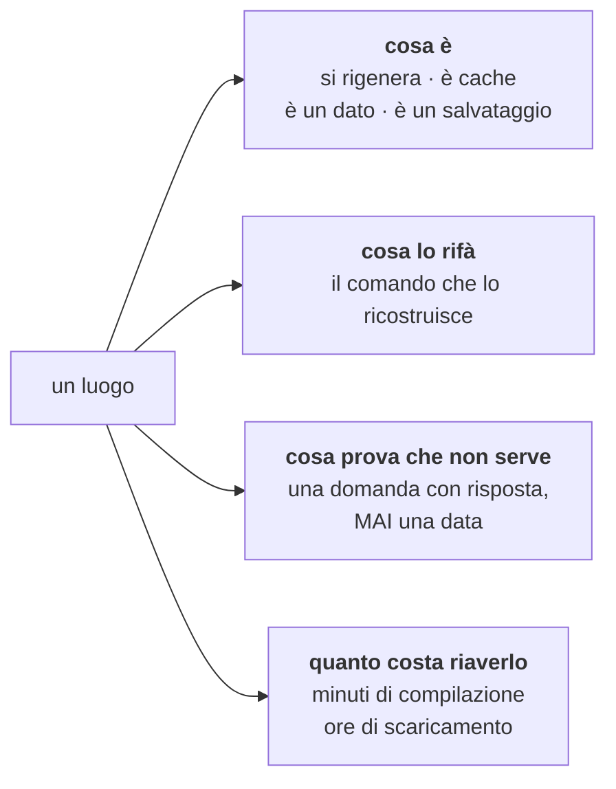
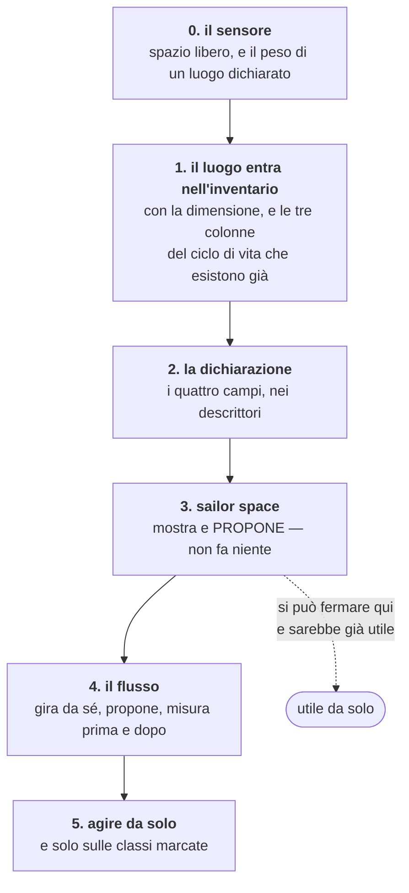

# Il ciclo di vita dello spazio

Piano scritto il 01/09/2026, il giorno in cui la macchina è arrivata a **911 MB
liberi su 460 GB** e la pulizia a mano ne ha recuperati 159. Ogni pezzo nominato
qui è stato verificato nel codice di `da2fd92`; dove una cosa non esiste, sta
scritto che non esiste.

**Non è il piano di un raccoglitore automatico.** È il piano per far sì che
Sailor sappia rispondere a «come sta la macchina» leggendo, invece di
raccontando — e solo dopo, e solo su ciò che è stato dichiarato, agire.

---

## 1. Il fatto di partenza, misurato

Il disco non era pieno di roba vecchia dimenticata. Ho cercato ogni cartella
sopra i 300 MB non toccata da più di sessanta giorni, in tutte le aree di
lavoro: **zero risultati**. Quello che riempiva la macchina era stato prodotto
nei giorni precedenti.

| cosa | quanto | chi lo produce |
|---|---|---|
| scratchpad di sessioni chiuse | 43 GB | ogni sessione, ogni giorno |
| cartelle di compilazione di 19 copie di lavoro | 24 GB | ogni batteria |
| compilazioni del clone principale | 20 GB | ogni batteria |
| immagini VM di un'applicazione | 9,4 GB | ogni aggiornamento |
| cloni di un esperimento chiuso e documentato | 5,4 GB | una volta, e poi mai più letti |

**È la ragione per cui questo piano serve.** Una pulizia a mano risolve il
sintomo per una settimana. Il problema è che nessuno *sa* quanto sta producendo,
e nessuno chiude niente.

---

## 2. Cosa Sailor ha già — e la sorpresa

**La sorpresa: il ciclo di vita esiste già, applicato alla cosa sbagliata.** La
tabella `inventory_items` ha tre colonne — `first_seen`, `last_seen`, `gone_at`
— che sono *esattamente* un ciclo di vita: quando l'ho visto la prima volta,
l'ultima, e quando è sparito. E `sailor inventory --changes` sa già dire cosa è
comparso e cosa è sparito. Tutto questo sorveglia competenze, agenti, comandi,
regole e ganci. **Non sorveglia un solo byte.**

C'è anche una distinzione che vale la pena riusare invece di reinventare:
`Reach` non è un booleano, è `Active` / `Inactive(motivo)` / `Unknown(motivo)`.
«Non c'è» e «non ho potuto guardare» sono già due cose diverse in questo codice.

---

## 3. Quello che manca non è il sensore

Leggere lo spazio libero sono venti righe. Il difetto vero è un altro, ed era già
scritto in una nota del 16/08/2026: **un'automazione slegata misura e non
ripara**. La mappa dei cicli di vita di quel giorno diceva che un raccoglitore
toccava quattro lavorazioni su ventidue.

**La parte difficile è decidere cosa si può buttare.** E qui non serve teoria: la
pulizia del 01/09 ha prodotto quattro prove, una per ogni modo in cui una regola
automatica avrebbe sbagliato.

| il caso | perché una regola sbaglia |
|---|---|
| una cartella `target/` | è **identica** che il cantiere sia vivo o morto. Il solo segnale disponibile era «ha compilato nell'ultima ora» — un'euristica che avrebbe cancellato l'albero di un cantiere in pausa da novanta minuti |
| `~/.ollama`, 4,9 GB | sembrava cancellabile, ma girava un contenitore chiamato `socraticode-ollama`. È stato sicuro **solo dopo aver ispezionato come è montato**: usa un volume Docker, non quella cartella. Il nome suggeriva il contrario del vero |
| gli 11 GB di un'applicazione | 9,4 erano immagini rigenerabili, 1,6 erano **dati della persona**. Una regola sulla cartella avrebbe preso tutto |
| `scratchpad-`**`salvati`** | il nome dice che qualcuno li aveva salvati apposta. Erano avanzi, ma per saperlo bisognava guardarci dentro |

E c'è una cicatrice, non un'ipotesi: in questo progetto **una prova lanciata con
`--esegui` ha smontato cinque copie di lavoro estranee**. Il vincolo di prudenza
è stato pagato.

---

## 4. La forma: un luogo si dichiara, non si indovina

Sailor ha già un meccanismo per questo, ed è quello che regge meglio di tutti. I
motori non stanno in un elenco scritto nel codice: ognuno ha un **descrittore**
che dichiara come gli si parla — con quali parole rifiuta una riga
(`refuses_without_prompt`), con quali dice di non poter lavorare
(`unusable_when`), come gli si chiede se è autenticato (`login_status`). E vale
la regola che ha salvato più volte di ogni altra: **chi non dichiara non fa
scattare niente. Tacere è diverso da indovinare.**

Lo stesso per lo spazio. Ogni **luogo** dichiara quattro cose:

**La terza è quella che fa il lavoro, e deve essere una domanda eseguibile.** Non
«non lo tocca nessuno da trenta giorni», ma:

- «`git worktree list` non elenca più questa copia di lavoro»
- «nessun processo nella tabella `processes` ha questa cartella come cartella di lavoro»
- «nessun contenitore acceso monta questo percorso»
- «l'identificativo di sessione in questo nome non è fra quelle vive»

Sono le stesse domande che ho dovuto fare a mano oggi. La differenza è che
scritte in un descrittore si fanno da sole, sempre, e chi le legge sa **perché**
un luogo è stato dichiarato inutile.

**La quarta non è un dettaglio**: dieci minuti di ricompilazione e due ore di
scaricamento non sono la stessa cosa, e un raccoglitore che le tratta uguale
libera spazio facendo perdere una mattinata.

---

## 5. I gradini, in ordine di dipendenza

**Gradino 0 — il sensore.** Spazio libero del volume, e il peso di un percorso.
Piccolo. Va nel posto dove sta già la misura di ciò che la macchina ha:
`crates/inventory`.

**Gradino 1 — un luogo è una voce.** `Entry` oggi ha `kind`, `name`,
`description`, `origin`, `path`, `reach`, `by_model`. Manca la dimensione, e
manca una famiglia `Kind::Place` accanto a `Skill`, `Agent`, `Command`, `Rule`,
`Hook`. Le tre colonne del ciclo di vita in `inventory_items` **non vanno
toccate**: sono già quelle giuste, e a quel punto `sailor inventory --changes`
comincia a dire anche «questo luogo è cresciuto di 12 GB in tre giorni», che
nessuno oggi sa.

**Gradino 2 — la dichiarazione.** I quattro campi, nella stessa forma dei
descrittori dei motori. Chi non dichiara resta censito e **non proponibile**: si
vede il peso, non si tocca.

**Gradino 3 — `sailor space`.** Mostra quanto c'è, quanto pesa ogni luogo
dichiarato, e cosa *si potrebbe* liberare con accanto **quanto costa riaverlo** e
**quale domanda ha risposto che non serve**. Non cancella niente. *Questo gradino
da solo risolve il 90% del problema di oggi*, perché il lavoro vero è stato
sapere dove guardare.

**Gradino 4 — il flusso.** Un flusso che gira da sé, chiede al sensore, e
**propone**. Due vincoli non negoziabili, tutti e due pagati con danno vero:
misura **prima e dopo** e scrive quanto ha liberato — oggi posso dire 159 GB
perché ho misurato, non perché ho stimato; e non tocca niente senza che una
persona abbia detto sì.

**Gradino 5 — agire da solo.** Solo sulle classi che il descrittore marca
esplicitamente come tali, solo dopo che il gradino 4 ha girato abbastanza volte
da far vedere che le sue proposte erano giuste, e sempre registrando cosa ha
tolto. Questo gradino **si può non fare mai**, e sarebbe comunque un successo.

---

## 6. Cosa non fare

- **Non dedurre l'inutilità da una data.** Un cantiere in pausa e un cantiere
  morto hanno la stessa data.
- **Non cancellare per cartella.** Gli 11 GB dell'applicazione erano 9,4 di
  rigenerabile e 1,6 di dati, nello stesso posto.
- **Non fidarsi dei nomi.** «scratchpad-salvati» conteneva avanzi;
  `socraticode-ollama` non usava `~/.ollama`.
- **Non far girare il raccoglitore contro lo stato vero della macchina mentre lo
  si costruisce.** Il 01/09 un cantiere ha migrato il deposito vivo credendo di
  lavorare su una copia, ed è il guasto 42.
- **Non aggiungere un secondo posto che sappia dove stanno le cose.** La
  scoperta della casa del deposito ha già avuto una gemella non sorvegliata per
  quattro giorni; la difesa è `only_the_ledger_knows_where_the_ledger_lives`.

---

## 7. Come si saprà che funziona

Non «il disco è più libero»: quello lo fa anche una cancellazione fortunata. Le
tre misure che distinguono un raccoglitore che funziona da uno che ha avuto
fortuna:

1. **Quanto ha liberato, misurato prima e dopo**, corsa per corsa. Un numero
   dichiarato e non misurato è il guasto 37 in un altro vestito.
2. **Quante proposte sono state accettate.** Un raccoglitore che propone cose che
   nessuno accetta ha capito male, e va corretto invece di ignorato.
3. **Quante volte qualcuno ha dovuto rifare qualcosa che era stato tolto.**
   È il costo vero, ed è l'unico numero che dice se la terza dichiarazione — «cosa
   prova che non serve» — è scritta bene.

E una prova che deve nascere rossa prima di ogni cosa: **un luogo non dichiarato
non viene mai proposto.** Il mutante che la rimette in rosso è far ricadere un
luogo sconosciuto sulla classe «si rigenera» — cioè il ripiego silenzioso su un
valore plausibile, che nel guasto 41 ha nascosto un difetto per quattro giorni.
